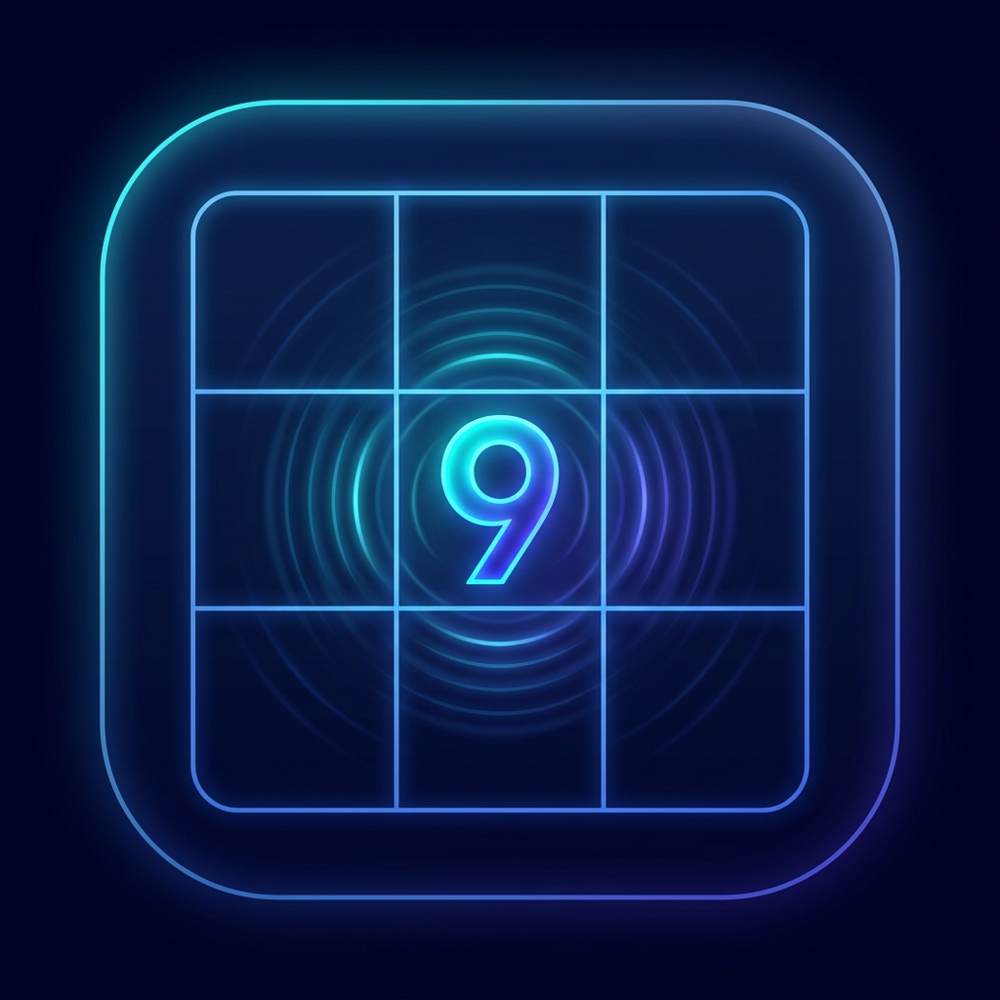

# ⚡ Sudoku Pulse

<p align="center">
  
</p>

Полнофункциональная классическая и аркадная игра **Sudoku Pulse**, написанная на чистом **TypeScript** без тяжелых сторонних фреймворков и игровых движков. Разработана для демонстрации алгоритмов генерации/решения, ООП, синтеза звука через Web Audio API, интерактивных анимаций и современного UX.

---

## 🎮 Режимы игры

1. **⚡ Классический режим (Classic)**:
   - Традиционное судоку с 4 уровнями сложности (Легкий, Средний, Сложный, Эксперт).
   - Поддержка комбо-множителя очков и режима **Fever Overdrive**.

2. **🌫️ Туман войны (Fog of War)**:
   - Всё поле скрыто во тьме!
   - Выбранная ячейка работает как фонарик, освещая зону вокруг курсора.
   - Каждая верно разгаданная цифра становится постоянным «маяком», который освещает себя и соседние ячейки.

3. **📅 Daily Pulse (Ежедневный вызов)**:
   - Единое поле для всех игроков мира, генерируемое по календарной дате через детерминированный PRNG-алгоритм (*Mulberry32*).
   - Подсчёт ежедневной серии побед (Daily Streak 🔥).
   - Виральный экспорт результата в формате Wordle («Скопировать для Telegram / ВКонтакте»).

4. **🚀 Pulse Run (Рогалик-забег)**:
   - Серия уровней с драфтом пассивных перков перед началом игры.

---

## ⚡ Уникальные механики

* **Pulse Combo & Fever Mode**:
  - Быстрые безошибочные ходы заполняют неоновую шкалу **PULSE** и увеличивают комбо-множитель ($1.5\times \dots 5.0\times$).
  - При 100% заполнении активируется **FEVER OVERDRIVE** ($10\times$ очков!): синтезатор Web Audio запускает плотную электронную басовую партию, шкала горит огненным градиентом, а комбо замораживается на 12–17 секунд.
* **Система Roguelike-перков**:
  - 🛡️ *Неоновый щит*: первая допущенная ошибка не тратит жизнь.
  - ⏳ *Тайм-варп*: шкала комбо остывает в 2 раза медленнее.
  - ⚡ *Супер-Овердрайв*: режим Fever длится на 5 секунд дольше.
  - 🔋 *Генератор энергии*: +1 дополнительная подсказка на старте.
  - 🔦 *Мощный фонарь*: радиус обзора в Тумане войны увеличен в 2 раза.
  - 💎 *Импульсный резонанс*: +50% бонусных Pulse очков за правильные ходы.
* **Главное меню (Game Hub)**:
  - Интуитивное лобби с переходами: «Играть», «Daily Pulse», «Рекорды», «Настройки».
  - Кнопка «В меню» во время игры для мгновенного возврата.
* **Раздельная подсветка ошибок и конфликтов**:
  - Красным подсвечивается только ошибочная ячейка (покачивается только цифра внутри). Конфликтующие ячейки в той же строке/столбце мягко пульсируют синим цветом.
* **Блокировка ячеек**:
  - Правильно заполненные ячейки фиксируются (`isLocked`) и защищены от случайного стирания.
* **Световая волна закрытия рядов**:
  - Завершение любой строки, столбца или квадрата $3 \times 3$ сопровождается эффектной световой волной и мажорным аккордом.
* **Процедурный аудио-синтезатор (Web Audio API)**:
  - Без внешних MP3-файлов: клики, верные ходы с повышением тона под комбо, ошибка, защитный щит, басовая линия Fever и победные фанфары.

---

## 📂 Структура проекта

```text
sudoku-pulse/
├── index.html           # Экраны: Главное меню, Режимы, Драфт перков, Игра, Модальные окна
├── package.json         # Скрипты и зависимости (TypeScript, Vite)
├── tsconfig.json        # Конфигурация компилятора TypeScript (strict mode)
├── vite.config.ts       # Относительные пути сборки
├── public/
│   └── icon.jpg         # Фирменная неоновая иконка приложения
└── src/
    ├── types.ts         # Модели данных (GameMode, AppScreen, Perk, CellData, Stats)
    ├── perks.ts         # Каталог перков и рандомизатор драфта
    ├── audio.ts         # Web Audio API синтезатор эффектов и Fever-музыки
    ├── solver.ts        # Алгоритм проверки правил и Backtracking-решатель
    ├── generator.ts     # Генератор полей с проверкой единственности и детерминированным сидом
    ├── game.ts          # Стейт-машина (Pulse combo, Fever, Fog of War, перки, счёт)
    ├── ui.ts            # Контроллер экранов, меню, рендеринг, клавиатура, шеринг
    ├── style.css        # Неоновый кибер-дизайн, анимации комбо, тумана и меню
    └── main.ts          # Точка входа приложения
```

---

## ⚙️ Установка и запуск

```bash
# Режим разработки
npm run dev

# Продакшн сборка
npm run build
```
Откройте браузер по адресу: `http://localhost:5173`.
